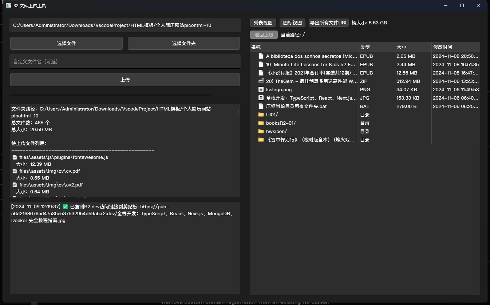
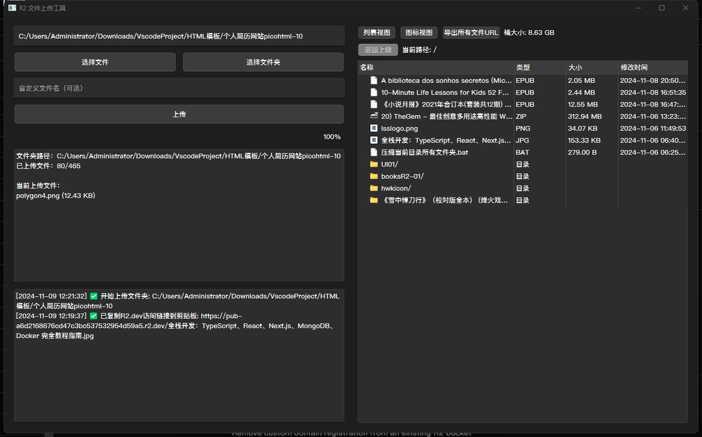
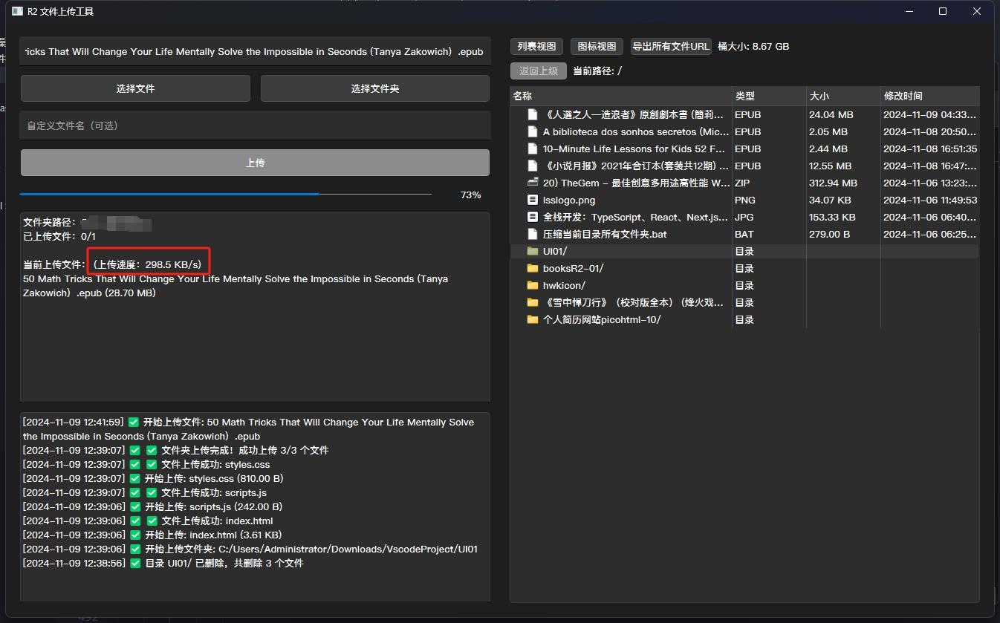
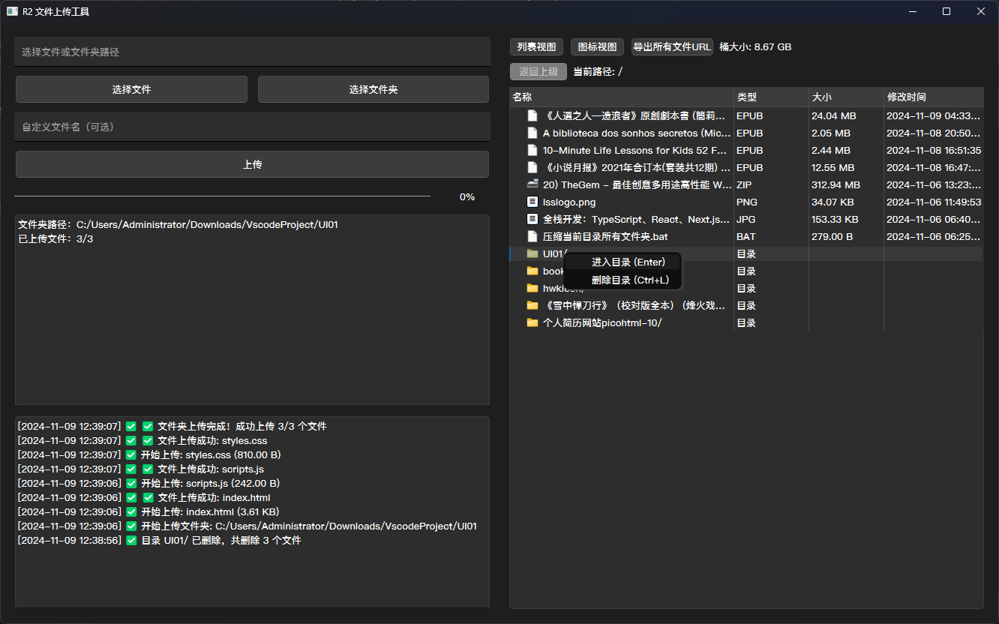
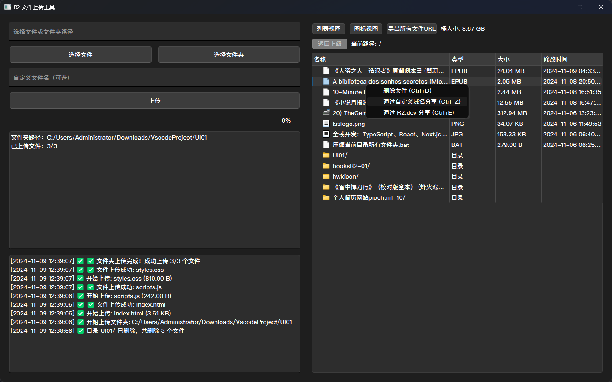
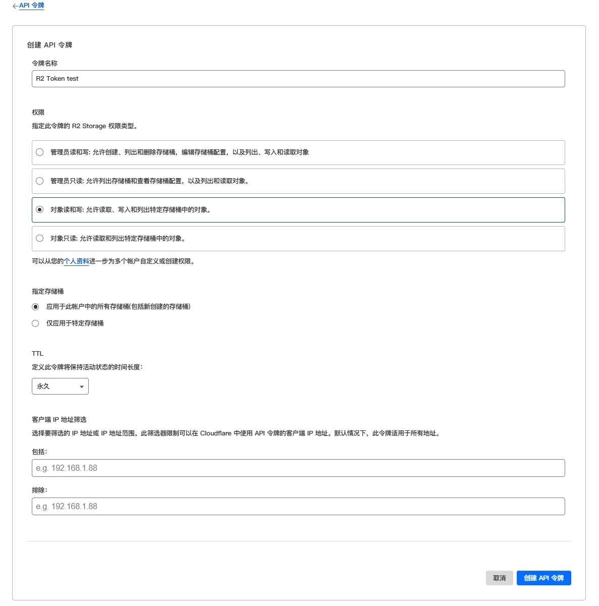
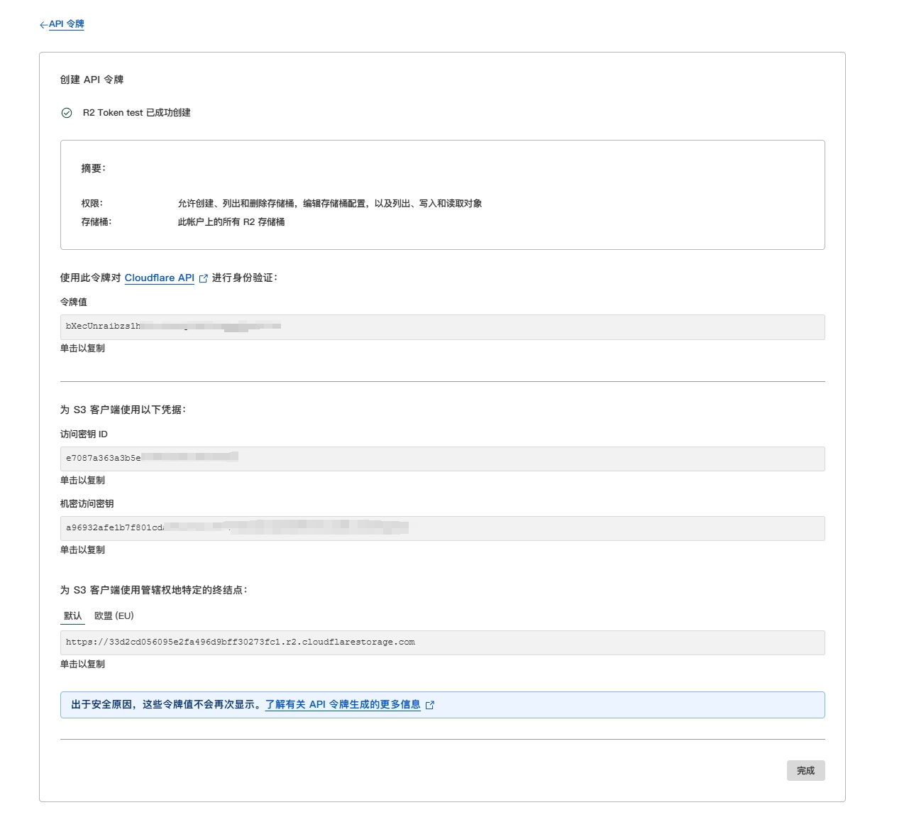
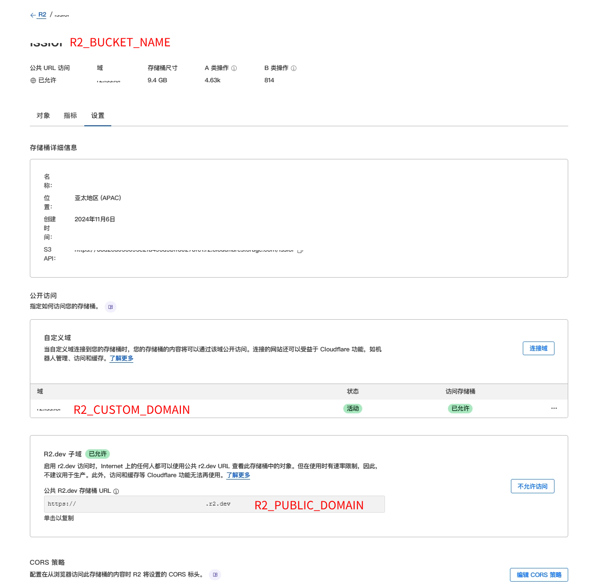

# Cloudfare-R2-FIle-Uploader
CLoudfare R2对象存储文件批量上传工具


# R2 文件上传工具使用指南

## 目录
- [简介](#简介)
- [环境准备](#环境准备)
- [配置文件设置](#配置文件设置)
- [使用说明](#使用说明)
- [高级功能](#高级功能)
- [注意事项](#注意事项)
- [常见问题](#常见问题)
- [更新日志](#更新日志)

## 更新日志

### v2.0 (2026-03-28)
**性能大幅提升**
- ⚡ 多文件上传速度提升 10 倍：支持自定义并发数量（1-50 个文件同时上传）
- 🚀 删除目录速度提升 1000 倍：采用批量删除技术
- 📊 进度显示更准确：实时显示已完成/总数、当前批次等详细信息
- 🛡️ 更安全的错误处理：失败文件单独记录，不影响其他文件操作

**新增功能**
- 🎛️ 并发线程数设置：可在界面上自由调整上传并发数（默认 10）
- 📈 详细进度反馈：删除操作显示成功/失败统计和具体原因
- ⚠️ 操作确认提示：删除目录前会显示文件数量和不可恢复警告

### v1.0 (初始版本)
- 基础文件上传功能
- 文件管理和分享功能
- 列表/图标视图切换

## 简介

这是一个基于 PyQt6 开发的图形界面工具，用于管理和上传文件到 Cloudflare R2 存储。

### 主要功能
- ✨ 文件/文件夹上传（支持并发上传，速度提升 10 倍）
- 📁 文件管理（删除、重命名等，批量删除速度提升 1000 倍）
- 🔗 文件分享（支持自定义域名和 R2.dev 域名）
- 📊 文件列表导出
- 🌏 支持中英文界面切换
- 👀 支持列表视图和图标视图
- ⌨️ 支持快捷键操作
- 🎛️ 可自定义并发上传数量（1-50 线程）

## 环境准备

### Python 环境要求
- Python 3.8 或更高版本
- pip 包管理工具

### 依赖包列表

本工具需要以下 Python 包：

| 包名 | 版本要求 | 说明 |
|------|---------|------|
| PyQt6 | >= 6.0.0 | GUI 框架 |
| PyQt6-SVG | >= 6.0.0 | SVG 图标支持 |
| boto3 | >= 1.26.0 | AWS S3/R2 客户端 |
| python-dotenv | >= 0.19.0 | 环境变量管理 |
| urllib3 | >= 1.26.0 | HTTP 客户端 |

### 快速安装

#### 方法一：一键安装脚本（推荐）

**Windows:**
```bash
install_dependencies.bat
```

**Linux/Mac:**
```bash
chmod +x install_dependencies.sh
./install_dependencies.sh
```

#### 方法二：手动安装

```bash
pip install -r requirements.txt
```

#### 方法三：逐个安装

```bash
pip install PyQt6 PyQt6-SVG boto3 python-dotenv urllib3
```


### Cloudflare R2 配置
1. 登录 Cloudflare 控制台
2. 进入 R2 > 创建存储桶
3. 获取以下信息：
   - Account ID
   - Access Key ID
   - Access Key Secret
   - Bucket Name
   - Endpoint URL

## 配置文件设置

1. 在脚本同目录创建 `.env` 文件
2. 填入以下配置信息：

````
R2_ACCOUNT_ID=你的Account_ID
R2_ACCESS_KEY_ID=你的Access_Key_ID
R2_ACCESS_KEY_SECRET=你的Access_Key_Secret
R2_BUCKET_NAME=你的存储桶名称
R2_ENDPOINT_URL=你的Endpoint_URL
R2_CUSTOM_DOMAIN=你的自定义域名(可选)
R2_PUBLIC_DOMAIN=你的R2.dev域名(可选)
````


## 使用说明

### 启动程序

````
python 脚本目录\r2_uploader_gui.py
````


### 文件上传

#### 单文件上传
1. 点击"选择文件"按钮
2. 选择要上传的文件
3. 可选填写自定义文件名
4. 点击"上传"按钮

#### 文件夹上传
1. 点击"选择文件夹"按钮
2. 选择要上传的文件夹
3. 可选调整"并发线程数"（默认 10，范围 1-50）
4. 点击"上传"按钮
5. 查看实时进度和上传速度

> 💡 提示：并发数越大上传越快，但会占用更多网络带宽。建议根据网络情况调整。

### 文件管理

#### 文件操作
- 双击文件夹进入
- 右键菜单或使用快捷键：
  | 操作 | 快捷键 |
  |------|--------|
  | 删除文件 | `Ctrl+D` |
  | 删除目录 | `Ctrl+L` |
  | 自定义域名分享 | `Ctrl+Z` |
  | R2.dev分享 | `Ctrl+E` |
  | 进入目录 | `Enter` |

#### 视图切换
- 列表视图：显示详细信息
- 图标视图：以图标方式显示

### 导出功能

点击"导出URL"按钮可导出所有文件的：
- 📝 文件名
- 📂 文件路径
- 🔗 访问URL
- 📊 文件大小

> 导出的CSV文件会保存在程序所在目录


## 高级功能

### 分片上传
- 大于50MB的文件会自动使用分片上传
- 支持断点续传
- 显示上传进度和速度

### 批量操作
- ✨ 支持文件夹批量上传（可自定义并发数，最高 50 个文件同时上传）
- 🗑️ 支持目录批量删除（自动批量处理，速度极快）
- 📥 支持 URL 批量导出
- 📊 详细的进度反馈和错误提示

### 快捷键列表
| 快捷键 | 功能 |
|--------|------|
| `Ctrl+D` | 删除文件 |
| `Ctrl+L` | 删除目录 |
| `Ctrl+Z` | 使用自定义域名分享 |
| `Ctrl+E` | 使用R2.dev域名分享 |
| `Enter`  | 进入目录 |


注意事项
1. 配置安全
⚠️ 请妥善保管 .env 文件
🚫 不要将密钥信息提交到代码仓库
2. 上传限制
📦 单文件大小限制取决于R2配置
💡 建议大文件使用分片上传
3. 域名配置
🌐 使用自定义域名需要先在Cloudflare配置好DNS
🔗 R2.dev域名为Cloudflare提供的默认域名
4. 性能优化
🚀 大量文件上传时会自动控制并发
🔄 会定期自动刷新文件列表和存储容量


---
# 支持我们
如果您觉得软件对你有帮助，记得支持我们：

[![点击支持我们]](https://hwk.mom/love)

感谢你的支持，让软件更加完善！ 
---


## 示例：选择文件夹上传


## 示例：上传过程


## 示例：上传速度


## 示例：文件右键菜单


## 示例：文件夹右键菜单


## 示例：创建API



## 示例：API信息


## 示例：bucket信息



 
## 支持我们
如果您觉得软件对你有帮助，记得支持我们：

[![点击支持我们]](https://lss.lol/love)

感谢你的支持，让软件更加完善！ 

  
